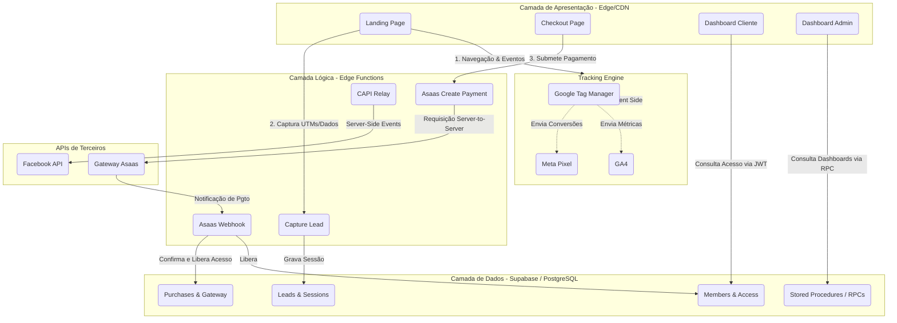
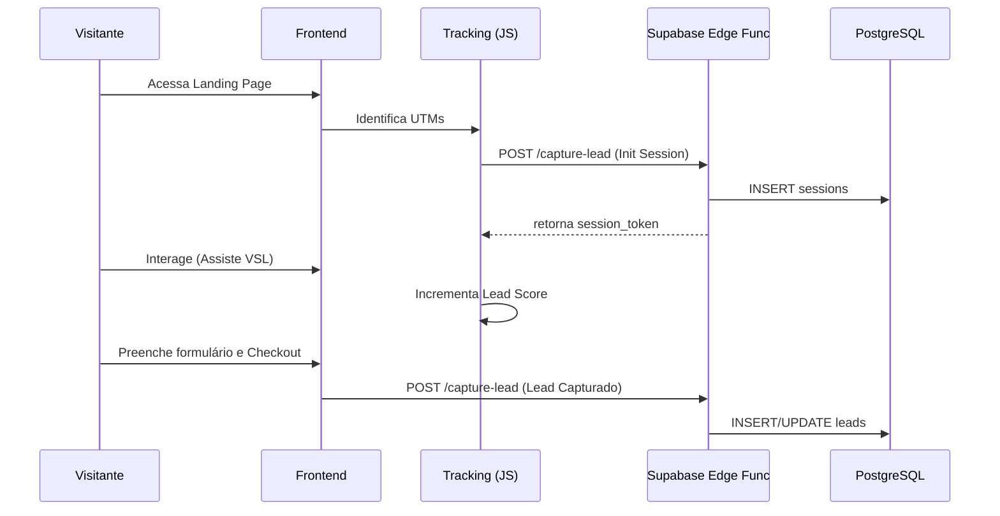

# 01. Arquitetura do Sistema

## 📌 Índice
1. [Objetivo e Responsabilidade](#objetivo-e-responsabilidade)
2. [Arquitetura Geral](#arquitetura-geral)
3. [Fluxo de Dados e Integração](#fluxo-de-dados-e-integração)
4. [Fluxo Financeiro](#fluxo-financeiro)
5. [Riscos e Melhorias Futuras](#riscos-e-melhorias-futuras)

---

## 🎯 Objetivo e Responsabilidade
O objetivo deste documento é mapear os principais componentes do NexusSaaS e mostrar como as peças conversam entre si. A responsabilidade da arquitetura desenhada aqui é assegurar **resiliência, escalabilidade barata e velocidade extrema** no tempo de carregamento da página final (LCP/FCP) para otimizar as métricas de tráfego pago (CAC).

---

## 🏛 Arquitetura Geral

O NexusSaaS foi particionado em um modelo híbrido de **Jamstack estático** + **Backend as a Service (BaaS)**.

- **Camada de Apresentação (Frontend):** 
  - Puramente arquivos HTML/CSS/JS (Vanilla).
  - Pode ser servido via Cloudflare Pages, AWS S3, ou Vercel. Cacheado 100% na borda (Edge).
- **Camada Lógica (Middleware/Edge Functions):**
  - Deno Functions hospedadas pelo Supabase. Atuam como proxies seguros, validando dados sensíveis antes de encostar no banco ou em parceiros financeiros (Asaas, Meta).
- **Camada de Dados (PostgreSQL):**
  - Gerenciado pelo Supabase. Modelagem fortemente tipada, com Triggers, Functions (RPCs) e Row Level Security garantindo proteção contra invasões pelo lado do cliente.

### Diagrama de Arquitetura Macro

---

## 🔄 Fluxo de Dados e Integração

A entrada de dados ocorre exclusivamente pelo Frontend e webhooks, garantindo um funil fechado:

1. **Entrada de Visitante:** O `tracking.js` inicializa, capta UTMs da URL e instancia um `correlation_id` (session storage).
2. **Registro Anônimo:** A função `capture-lead` gera a linha na tabela `sessions`.
3. **Engajamento:** Scores de engajamento (scroll, cliques) aumentam o Lead Score, salvando no `localStorage` e refletindo em chamadas pontuais (debounced) pro banco.
4. **Checkout:** Ao preencher o email, um pré-lead é criado. Submetendo os dados financeiros, o payload (com hash de PII para CAPI) é despachado para a Edge Function `asaas-create-payment`.

### Diagrama de Sequência do Lead

---

## 💸 Fluxo Financeiro

O fluxo de processamento de pagamentos prioriza segurança (PCI-DSS delegada) e confiabilidade matemática (Idempotência).

1. O client **jamais** faz chamadas diretas ao Asaas. Ele envia os dados (CPF, Cartão) criptografados por SSL para a `asaas-create-payment`.
2. A Edge Function recebe, mascara os logs do cartão, cria o customer no Asaas, cria a cobrança, salva o ID no Supabase (`payment_attempts` e `asaas_payments`) e retorna o status (ou PIX Copy/Paste).
3. O client inicia um Polling (a cada 5s) via RPC `get_checkout_status` aguardando a confirmação real.
4. O Asaas envia o Webhook de aprovação. A função `asaas-webhook` retém o log, garante que não seja duplicação e altera a flag `access_granted = true`.
5. O Polling do frontend detecta o update e joga o usuário na tela de Obrigado / Upsell.

---

## ⚠️ Riscos e Melhorias Futuras

### Riscos Conhecidos
- **Single Point of Failure em Gateways:** Se o Asaas sofrer indisponibilidade, todo o funil converte em falha, visto que é o único meio implementado.
- **Payload Exposure:** Mesmo com HTTPS, dados de cartão trafegam da máquina cliente para a Edge Function do Supabase. A Edge Function não os armazena, mas a memória temporária da Edge deve ser observada rigorosamente para que exceptions não printem os dígitos integrais em logs corporativos.

### Melhorias Futuras (Roadmap Arquitetural)
- **Roteador de Gateways (Fallbacks):** Arquitetar o `gateway_module` para tentar cobrar via Stripe se o Asaas recusar a transação por anti-fraude genérico.
- **Cache Centralizado (Redis):** Substituir as queries de polling por um Pub/Sub real-time (Supabase Realtime) via WebSockets para evitar peso na CPU do Postgres durante picos de checkouts.
