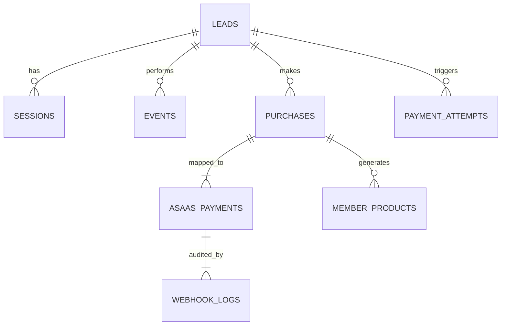

# 02. Banco de Dados

## 📌 Índice
1. [Objetivo e Responsabilidade](#objetivo-e-responsabilidade)
2. [Arquitetura de Dados](#arquitetura-de-dados)
3. [Tabelas: Módulo Tracking e Leads](#tabelas-módulo-tracking-e-leads)
4. [Tabelas: Módulo Financeiro e Gateways](#tabelas-módulo-financeiro-e-gateways)
5. [Tabelas: SRE e Confiabilidade](#tabelas-sre-e-confiabilidade)
6. [Tabelas: Segurança](#tabelas-segurança)
7. [Retenção e Volume Esperado](#retenção-e-volume-esperado)

---

## 🎯 Objetivo e Responsabilidade
Este módulo concentra toda a persistência do sistema. Ele é projetado visando extrema consistência para evitar dupla liberação de licenças ou perda de leads, adotando forte tipagem relacional no Supabase (PostgreSQL 15).
**Regra de Ouro:** O banco de dados é a última linha de defesa. O Row Level Security (RLS) deve estar habilitado em todas as tabelas.

---

## 🏛 Arquitetura de Dados

O banco de dados é fragmentado logicamente (schemas lógicos via naming convention e separação de scripts `_module.sql`) para não inflar um diagrama monolítico.

---

## 🗂 Tabelas: Módulo Tracking e Leads

### `leads`
- **Objetivo:** Armazenar dados do lead (identificado por e-mail).
- **Colunas chave:** `email` (UNIQUE), `utm_*`, `em_hash`, `ph_hash` (PII em SHA-256 para CAPI), `lead_score`, `lead_tier`, `lead_status`.
- **Relacionamentos:** 1:N com `purchases`, `payment_attempts`.
- **Índices:** `idx_leads_email` (UNIQUE).
- **Policies (RLS):** Insert para anon (apenas novo). Select, Update, Delete restritos a Admin/Edge Functions.

### `sessions`
- **Objetivo:** Captura do `correlation_id` / `session_id` anônimo para amarrar os steps antes do opt-in.
- **Policies:** Totalmente restrito a inserção `anon`, sem Select client-side.

### `events`
- **Objetivo:** Log de eventos de tracking (ex: InitiateCheckout, ViewContent).
- **Colunas:** `event_id` (UNIQUE para CAPI), `event_name`, `params` (JSONB).

### `lead_journey` e `attribution`
- **Objetivo:** Logs multi-touch para montar o LTV e funil no Dashboard Admin.

---

## 💳 Tabelas: Módulo Financeiro e Gateways

### `payment_gateways`
- **Objetivo:** Catálogo dinâmico de provedores de pagamento.
- **Policies:** Somente Admin.

### `gateway_events`
- **Objetivo:** Eventos globais de gateway com suporte a idempotência.
- **Colunas:** `gateway`, `event_type`, `status`, `event_id` (UNIQUE CONSTRAINT essencial).

### `payment_attempts`
- **Objetivo:** Guardar recusas e falhas de pagamento para posterior carrinho abandonado.

### `asaas_customers` & `asaas_payments`
- **Objetivo:** Manter a ponte de IDs (Reference_id) entre a infra local e a infra da Asaas.
- **Relacionamento:** `asaas_payments` tem FK pra `purchases` e `leads`.

### `subscriptions` & `refunds`
- **Objetivo:** Gestão de LTV e estornos.
- **Triggers:** Possuem as triggers `on_refund_processed` e `on_subscription_cancelled` que invocam a RPC `handle_access_revocation()` para cortar o acesso na tabela `member_products` instantaneamente.

### `purchases` e `member_products`
- **Objetivo:** A tabela `purchases` é o espelho financeiro da compra. A tabela `member_products` é o espelho de autorização de uso (Access Rights).

---

## 🛡 Tabelas: SRE e Confiabilidade

### `webhook_idempotency`
- **Objetivo:** Garantir que o mesmo webhook ID (Ex: da Asaas) recebido 3 vezes seja processado apenas uma vez.

### `dead_letter_queue`
- **Objetivo:** Isolar requisições webhooks ou automações que crasharam durante o processamento da Edge Function (Ex: banco indisponível momentaneamente) para retry.

### `webhook_logs` & `financial_logs`
- **Objetivo:** Auditoria integral. Guarda o body puro do webhook em JSONB.

---

## 🔒 Tabelas: Segurança

### `admin_users`
- **Objetivo:** Armazenar os e-mails com privilégios. As functions de RLS checam: `auth.jwt() ->> 'email' IN (SELECT email FROM admin_users)`.

### `rate_limits`
- **Objetivo:** Controle de disparos do client (ex: evitar DDoS na rota de conversão).

---

## 📈 Retenção e Volume Esperado

- **Leads e Purchases:** Retenção infinita (Dado Core).
- **Events:** Retenção configurada via cron job (pg_cron) para 90 dias (Dado efêmero).
- **Webhook Logs:** Retenção de 30 dias.
- **Volume Esperado:** Cerca de 10.000 events/mês e 5.000 webhook logs/mês por cada projeto escalado. Recomendação de particionamento (Table Partitioning) na tabela `events` para o próximo ano.
