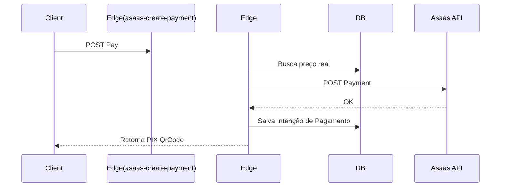

# 03. Edge Functions

## 📌 Índice
1. [Objetivo e Responsabilidade](#objetivo-e-responsabilidade)
2. [Lista de Funções e Fluxos](#lista-de-funções-e-fluxos)
3. [Validações e Segurança Global](#validações-e-segurança-global)
4. [Tratamento de Erros e Observabilidade](#tratamento-de-erros-e-observabilidade)
5. [Riscos e Melhorias](#riscos-e-melhorias)

---

## 🎯 Objetivo e Responsabilidade
As Edge Functions (executando Deno V8 Engine no Supabase) encapsulam toda a lógica de negócio sensível. Nenhuma credencial de API externa (Asaas, Meta) fica disponível no frontend. Tudo deve transitar pelas Edge Functions.

**Responsabilidade Principal:** Proteger as transações financeiras, realizar hash de dados sensíveis e orquestrar eventos entre APIs terceiras.

---

## 📜 Lista de Funções e Fluxos

### 1. `asaas-create-payment`
- **Objetivo:** Encapsular a criação de charges no gateway Asaas e mapear no DB.
- **Entrada (Payload):** `lead_id`, `product_slug`, dados do pagador, payload do cartão (se crédito).
- **Saída:** ID da transação Asaas e Payload do PIX copia e cola/Boleto URL.
- **Fluxo:**
  1. Valida se CPF/Cartão estão preenchidos.
  2. Consulta banco (Service Role) para confirmar o preço do produto evitando injeção de valor via Frontend.
  3. Cria o customer no Asaas caso não exista (ou resgata).
  4. Realiza POST para `/v3/payments` do Asaas.
  5. Salva dados na tabela `asaas_payments`.
- **Integrações:** API V3 Asaas.

### 2. `asaas-webhook`
- **Objetivo:** Receber aprovações ou declínios de pagamentos assíncronos.
- **Entrada:** Body do webhook do Asaas.
- **Fluxo:**
  1. Checa a chave `asaas-access-token` (Segurança).
  2. Salva body raw em `webhook_logs`.
  3. Checa `webhook_idempotency` usando o ID do evento Asaas.
  4. Se status == 'PAYMENT_RECEIVED' ou 'CONFIRMED', invoca regras de liberação de produto (Insert `member_products` / `purchases`).
- **Autenticação:** Header customizado validado com env var.

### 3. `capi-relay`
- **Objetivo:** Conversions API do Meta Ads via Servidor.
- **Entrada:** `event_name`, PII hasheados (`em`, `ph`), `fbclid`, `fbp`, valor.
- **Saída:** Status 200 (Success to Meta).
- **Tratamento de Erro:** Falhas da Graph API são printadas silenciosamente sem interromper o usuário.

### 4. `capture-lead`
- **Objetivo:** Inicializar sessão e upsertar lead info.
- **Entrada:** UTMs, Correlation ID, Email (opcional).

### 5. `automation-dispatcher`
- **Objetivo:** Encaminha payloads formatados para n8n ou Zapier, servindo como uma proxy outbound de eventos limpos.

---

## 🔒 Validações e Segurança Global

- **CORS:** O servidor responde ao OPTIONS bloqueando domínios não whitelistados em ambiente de produção.
- **Autenticação de Rota:** Algumas rotas (como `capture-lead`) usam a Anon Key JWT validando a origem. Rotas de Webhook dependem de tokens fixos assinados no cabeçalho.
- **Sanitização:** Payloads de log que contêm dados de cartões de crédito sofrem masking (ex: `**** **** **** 1234`) **antes** do `console.log()` ou do insert no banco.

---

## 🐛 Tratamento de Erros e Observabilidade

As Functions possuem blocos de `try/catch` de alto nível.
- **Padrão de Resposta Falha:** HTTP 400 ou 500 retornando `{ success: false, error: "mensagem segura" }`. O Trace stack nunca vaza pro frontend.
- **Logs:** Impressos no console do Supabase (acessíveis pelo Dashboard Log Explorer).
- **Observabilidade em Webhooks:** Caso a function `asaas-webhook` sofra falha no meio do processo, o evento Asaas não pode ser retornado como 200 (se não for gravado), permitindo que a própria Asaas tente novamente. Caso seja erro lógico da engine, é empurrado pro **DLQ (Dead Letter Queue)** do DB e retorna 200.

---

## ⚠️ Riscos e Melhorias

- **Frio no Boot (Cold Start):** Como são Deno functions nativas na infra da Supabase, a primeira execução pode sofrer cold-start (200-500ms).
- **Recomendação Futura:** Implementar testes unitários via script Deno para garantir que o Payload Mapping para o Asaas não quebre em atualizações da API deles.
