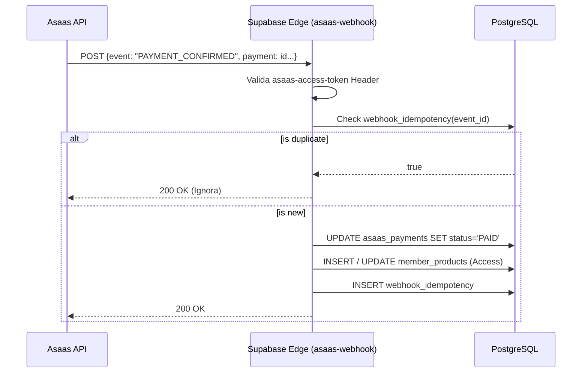

# 08. Sistema Financeiro

## 📌 Índice
1. [Objetivo e Responsabilidade](#objetivo-e-responsabilidade)
2. [O Provedor Asaas](#o-provedor-asaas)
3. [Tipos de Pagamento](#tipos-de-pagamento)
4. [Fluxo e Webhook](#fluxo-e-webhook)
5. [Split Financeiro e Logs](#split-financeiro-e-logs)
6. [Upsell Automático](#upsell-automático)

---

## 🎯 Objetivo e Responsabilidade
Gerir toda a arrecadação da plataforma de forma blindada contra fraudes de client-side. A responsabilidade do sistema não é manter o saldo, mas orquestrar o processo transacional junto ao gateway Asaas. Todo o reflexo financeiro deve residir com exatidão na tabela `purchases` para ser consumido pelo módulo de Analytics Executivo.

---

## 🏦 O Provedor Asaas

Escolhemos o Asaas devido à flexibilidade de sua API, custo competitivo no PIX e suporte ao Split Transparente na fonte. 
A arquitetura `multi-gateway` já previu tabelas em `2026_06_16_gateway_module.sql`, logo toda intenção de pagamento passa por uma tabela `asaas_payments` (específica) antes de atingir a `purchases` (global), preparando o terreno para Stripe/MercadoPago no futuro.

---

## 💳 Tipos de Pagamento

1. **PIX Dinâmico:** Fluxo imediato. A Edge Function chama a API Asaas e retorna o `encodedImage` em Base64 e o payload Copy/Paste pro DOM. O frontend inicia o polling RPC na mesma hora.
2. **Cartão de Crédito:** Transação síncrona/assíncrona. Dados trafegados criptografados e convertidos em token pelo Gateway. Aprovação imediata (gera insert de `purchase` já confirmado).
3. **Boleto:** Status persistido como 'pending'. URL do bankSlip redireciona o cliente para a impressão.

---

## 🔄 Fluxo e Webhook

O fluxo transacional assíncrono é baseado em Webhooks:

---

## 🔪 Split Financeiro e Logs

O módulo Split (Atualmente Experimental) viabiliza afiliados e parceiros de comissão.
- O rateio ocorre **na fonte** via requisição da Edge Function para a API do Asaas.
- O Asaas envia o saldo Líquido via Webhook.
- O Módulo extrai o rateio (Fee Gateway, Comissão Parceiro, Valor Líquido Empresa) e armazena detalhado na tabela `financial_logs`.

---

## 🚀 Upsell Automático (One-Click Buy)

Em produtos One-Time-Offer (OTO), quando o cliente navega para a página de Obrigado (`upsell.html`) imediatamente após uma compra em Cartão de Crédito, o client aproveita o Session Token.
Ao invés de digitar o cartão novamente, a plataforma utiliza o `asaas_customer_id` mapeado e a flag de billingToken salvo na API Asaas para forçar um débito adicional instantâneo, alavancando drasticamente o Ticket Médio (AOV).
